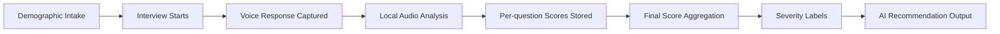
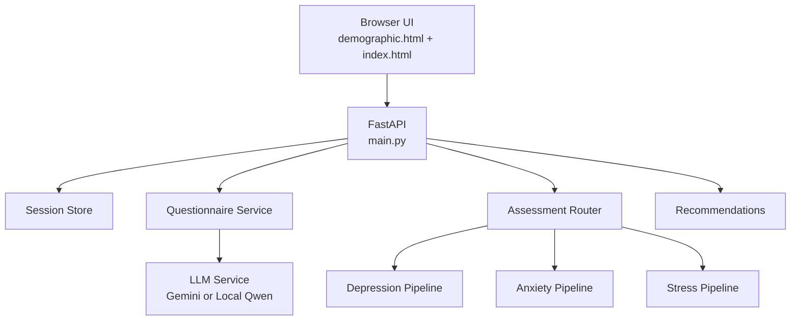

# MindSpace: Mental Health AI Interviewer

<p align="center">
  <strong>A multi-model mental health screening app that combines conversational interviewing, speech-based inference, and AI-generated guidance.</strong>
</p>

<p align="center">
  
  
  
  
  
</p>

---

## Overview

MindSpace is an integrated mental health interviewer built around three screening pipelines:

- `Depression` via speech-emotion features + XGBoost
- `Anxiety` via MFCC, pitch, and jitter features + gradient boosting
- `Stress` via wav2vec2 embeddings + a classifier

The app serves a polished demographic intake page, runs a guided voice interview, analyzes uploaded speech locally, and returns structured recommendations. Natural-language question generation and final advice can use either:

- `Gemini` through `google-generativeai`
- `Qwen/Qwen2.5-0.5B-Instruct` as a local fallback

## What It Does

- Collects participant context through a demographic intake flow
- Starts a personalized multi-turn interview
- Records microphone audio in the browser
- Runs local model inference during the session
- Aggregates scores across questions
- Labels severity for depression, anxiety, and stress
- Generates a recommendation summary with action items and resources

## Product Flow



## Architecture Snapshot



## Interface Preview

The current UI includes:

- A glassmorphism demographic intake screen with collapsible context sections
- A full interview dashboard with progress tracking, voice controls, and result overlays
- Severity visualizations and personalized recommendations at the end of the session

For deeper technical notes, see [ARCHITECTURE.md](/c:/Users/SOURENDRA/OneDrive/Desktop/IIT_KGP/Sem-6/IS_Project/Mental-Health-ai-interviewer/docs/ARCHITECTURE.md) and [DEPLOYMENT.md](/c:/Users/SOURENDRA/OneDrive/Desktop/IIT_KGP/Sem-6/IS_Project/Mental-Health-ai-interviewer/docs/DEPLOYMENT.md).

## Tech Stack

| Layer | Implementation |
|---|---|
| Backend API | FastAPI + Uvicorn |
| Frontend | Vanilla HTML, CSS, JavaScript |
| Depression pipeline | wav2vec2 SER features -> XGBoost |
| Anxiety pipeline | librosa + parselmouth features -> GBR pipeline |
| Stress pipeline | Wav2Vec2 embeddings -> StudentNet-style classifier |
| LLM options | Gemini 2.5 Flash or local Qwen 2.5 0.5B |
| Audio handling | ffmpeg, pydub, librosa, torchaudio |

## Repository Layout

```text
Mental-Health-ai-interviewer/
|-- main.py
|-- demographic.html
|-- demographic.css
|-- demographic.js
|-- index.html
|-- requirements.txt
|-- docs/
|   |-- ARCHITECTURE.md
|   `-- DEPLOYMENT.md
|-- models/
|   |-- anxiety/gbr_pipeline.joblib
|   `-- depression/phq_xgb.pkl
|-- pipelines/
|   |-- anxiety_pipeline.py
|   |-- depression_pipeline.py
|   `-- stress_pipeline.py
|-- scripts/
|   |-- download_local_llm.py
|   |-- download_ser_model.py
|   |-- download_stress_models.py
|   |-- prepare_offline_assets.py
|   `-- verify_setup.py
|-- services/
|   |-- assessment_router.py
|   |-- llm_service.py
|   |-- questionnaire.py
|   |-- recommendations.py
|   `-- session_store.py
`-- utils/
    |-- audio_common.py
    |-- config.py
    `-- file_utils.py
```

## Setup

### 1. Create and activate a virtual environment

```bash
cd Mental-Health-ai-interviewer
python -m venv venv
venv\Scripts\activate
```

On macOS/Linux:

```bash
source venv/bin/activate
```

### 2. Install dependencies

```bash
pip install -r requirements.txt
```

### 3. Create `.env`

Create a file named `.env` in the project root:

```env
GEMINI_API_KEY=your_key_here
GEMINI_MODEL_NAME=gemini-2.5-flash
HOST=0.0.0.0
PORT=8000
TOTAL_QUESTIONS=5
```

Optional local-LLM settings:

```env
LOCAL_LLM_MODEL_NAME=Qwen/Qwen2.5-0.5B-Instruct
LOCAL_LLM_MAX_NEW_TOKENS=256
```

### 4. Prepare model assets

This project expects two local model files to already exist:

- `models/depression/phq_xgb.pkl`
- `models/anxiety/gbr_pipeline.joblib`

Then download cached external assets:

```bash
python scripts/prepare_offline_assets.py
```

### 5. Verify the environment

```bash
python scripts/verify_setup.py
```

### 6. Run the application

```bash
python main.py
```

Open `http://localhost:8000`.

## Model Assets

| Asset | Source | Approx. size | Purpose |
|---|---|---:|---|
| `phq_xgb.pkl` | local repo file | small | Depression score prediction |
| `gbr_pipeline.joblib` | local repo file | small | Anxiety score prediction |
| `wav2vec2-large-xlsr-53-english` | Hugging Face cache | ~1.2 GB | Depression SER features |
| `WAV2VEC2_BASE` | torchaudio cache | ~360 MB | Stress embeddings |
| `voice-based-stress-recognition` | Hugging Face cache | ~5 MB | Stress classification |
| `Qwen/Qwen2.5-0.5B-Instruct` | Hugging Face cache | ~1 GB | Local question/recommendation generation |

## API Surface

| Method | Route | Purpose |
|---|---|---|
| `GET` | `/` | Serve demographic intake page |
| `GET` | `/interview` | Serve interview UI |
| `GET` | `/health` | Basic service health |
| `GET` | `/model_status` | Model readiness summary |
| `GET` | `/llm_status` | Gemini availability |
| `GET` | `/local_llm_status` | Local LLM availability |
| `POST` | `/submit_demographics` | Save intake data |
| `GET` | `/start` | Start interview session |
| `POST` | `/next_question` | Request next interview question |
| `POST` | `/analyze_speech` | Upload and score audio |
| `GET` | `/results` | Get final screening output |
| `POST` | `/exit_session` | End and clear the session |

## Local vs Online Components

### Runs locally

- Depression inference
- Anxiety inference
- Stress inference
- Audio processing
- FastAPI backend
- Frontend pages
- Optional local Qwen LLM

### Requires internet

- Gemini API calls
- First-time model downloads from Hugging Face or torchaudio sources

## Important Notes

- This project is a screening and recommendation system, not a medical diagnosis tool.
- `verify_setup.py` currently mentions copying `.env.example`, but this repository does not include that file; create `.env` manually.
- Session storage is in-memory through the default session store, so restarting the app clears active sessions.
- The UI is optimized for a browser with microphone permissions enabled.

## Development Commands

```bash
python scripts/download_ser_model.py
python scripts/download_stress_models.py
python scripts/download_local_llm.py
python scripts/prepare_offline_assets.py
python scripts/verify_setup.py
```

## Documentation

- [Architecture Notes](/c:/Users/SOURENDRA/OneDrive/Desktop/IIT_KGP/Sem-6/IS_Project/Mental-Health-ai-interviewer/docs/ARCHITECTURE.md)
- [Deployment Guide](/c:/Users/SOURENDRA/OneDrive/Desktop/IIT_KGP/Sem-6/IS_Project/Mental-Health-ai-interviewer/docs/DEPLOYMENT.md)

## Future Improvements

- Persist sessions with Redis or a database
- Add authentication and multi-user session isolation
- Export reports as PDF
- Add structured clinician-facing analytics
- Add tests for API routes and frontend flow

## Disclaimer

This repository is intended for academic, research, and prototype use. If a user is in crisis or may be at risk of self-harm, direct them to immediate professional or emergency support in their region.
